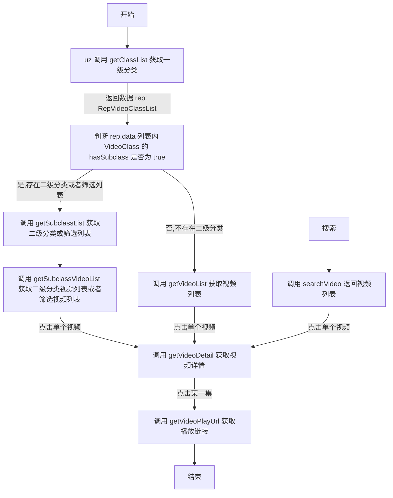
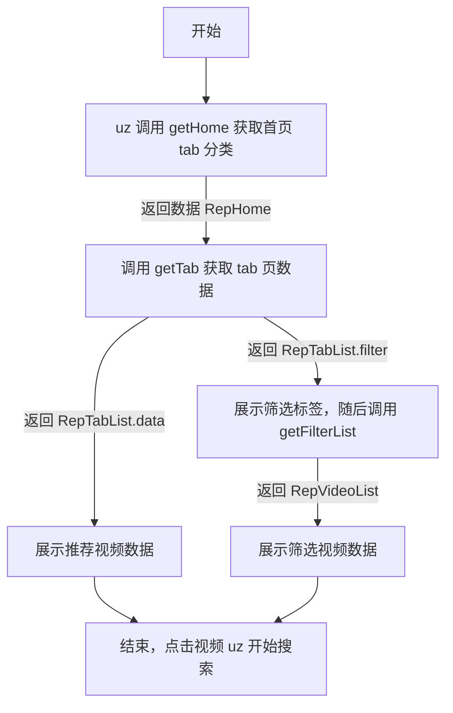

- [扩展说明](#扩展说明)
- [uzVideo(视频源) 扩展运行说明](#uzvideo视频源-扩展运行说明)
- [uzHome(首页推荐) 扩展运行说明](#uzhome首页推荐-扩展运行说明)
- [加密说明](#加密说明)
- [修改记录](#修改记录)
    - [v1.5.50](#v1550)
    - [v1.5.40](#v1540)
    - [v1.4.00](#v1400)
    - [v1.3.00](#v1300)

# 扩展说明

1. 感谢您的关注，由于作者对 `js` 了解甚少，所以内置的代码不够全面。**如果您要编写 uz 可执行的扩展需要添加代码或其他问题，可以联系[机器人](https://t.me/uzVideoAppbot)**
2. `uzVideo.js` 为视频源扩展，提供观看视频的能力。内部定义了一些类和方法，您需要在扩展中实现 `WebApiBase` 的所有方法。
3. `uzHome.js` 为首页推荐扩展，提供视频推荐能力。
4. uz 内部仅有一个运行时，所有 `js` 代码（包括扩展）都在一起加载执行。所以您的扩展内类名一定要特殊，实例名称也要特殊
5. 不支持 `import` `export`
6. 集成库可在 `uz3lib.js` 查看，如需添加其他库通用库请联系[机器人](https://t.me/uzVideoAppbot)
7. 成对使用 `// ignore` uz 内部会忽略包裹的内容

# uzVideo(视频源) 扩展运行说明

1. 执行每个方法都会为 `webSite` 进行赋值
2. json 文件说明

```
{
  "name": "名称",
  "codeID": "如果选择了加密请填写，由 uz 生成",
  "api": "扩展链接",
  "instance": "实例名称",
  "webSite": "视频站地址。当加载代码时会赋值给对象的 webSite 属性，用户可自行在 app 内修改",
  "remark": "备注",
  "noHistory": false, // *不开启*历史记录 默认false(即开启历史记录)，用户可自行在 app 内修改
  "userAgent": "", // 设置播放ua 优先级低于 getVideoPlayUrl 返回ua，用户可自行在 app 内修改
  "isLock": false, // 是否上锁 默认false(即不上锁)，用户可自行在 app 内修改
  "blockClassList": ["短剧"] // 屏蔽分类，用户可自行在 app 内修改
}
```

3. 流程图



# uzHome(首页推荐) 扩展运行说明

1. 固定实例名称为 `uzHomeJs` （例如 const uzHomeJs = new UZHomeJS();）
2. json 文件说明

```
{
  "name": "名称",
  "codeID": "如果选择了加密请填写，由 uz 生成",
  "url": "扩展链接"
}
```

3. 如需添加更多 UI 类型，请联系[机器人](https://t.me/uzVideoAppbot)
4. 流程图



# 加密说明

1. 您的扩展代码由 uz 进行加密，并生成 `codeID` 用于扩展解密。
2. `codeID` 每次都是随机生成，不可指定。请将 `codeID` 添加进 `json` 文件内。
3. app 设置页 `sid` 为用户标识，卸载、重置等情况下可能会发生变化。
4. `VerifyLink` `SaltApp2Backend` `SaltBackend2App` 为选填项，用于控制谁 `sid` 可以添加使用您开发的扩展。(仅在添加时进行验证)。
5. 推荐使用 `cloudflare worker` 进行验证。
6. 验证相关代码请见 `verifyServer.js` 请注意修改 `salt` 及 `sid` 验证逻辑。

# 修改记录

### v1.5.50

1. 支持使用 uz 加密扩展，加密后请将 `codeID` 填写在 `json` 文件内。
2. 新增首页推荐扩展类型 `uzHome.js`

### v1.5.40

1. `req` 支持设置 `responseType` 值为字符串 `json、arraybuffer、bytes、plain、stream`
2. `vod_pic` 支持 data url 格式
3. `RepVideoPlayUrl.data` 支持 data url 格式

### v1.4.00

1. 增加二级分类和筛选列表功能

### v1.3.00

1. 去掉 `cat.js`, 更改为 `cheerio` `Crypto` `Encrypt` `parse(后期可能会移除，推荐优先使用 cheerio)`
2. `VideoDetail` 新增 `quarkUrl` 支持夸克网盘
3. `RepVideoPlayUrl` 新增 `headers` 支持设置播放 `header`
