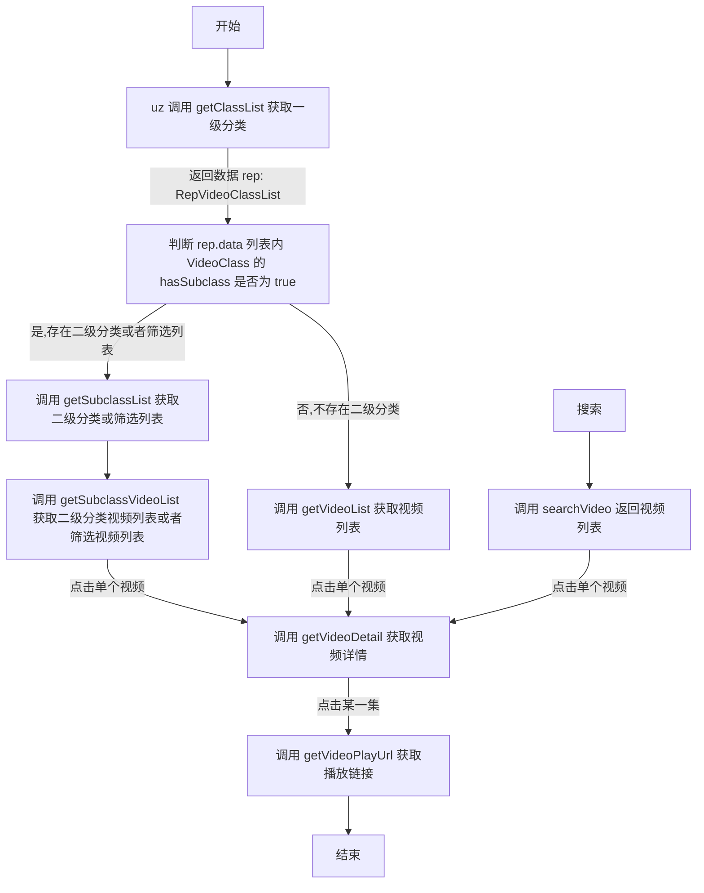

# 编写 uz 可执行的脚本

1. 感谢您的关注，由于作者对 js 了解甚少，所以内置的代码不够全面。**如果您要编写 uz 可执行的脚本需要添加代码或其他问题，可以联系[机器人](https://t.me/uzVideoAppbot)**
2. uzCode.js 内部定义了一些类和方法，您需要在脚本中实现 WebApiBase 的所有方法
3. uz 内部仅有一个运行时，所有 js 代码（包括脚本）都在一起加载执行。所以您的脚本内类名一定要特殊，实例名称也要特殊
4. 不支持 import export
5. 集成库可在 `uz3lib.js` 查看，如需添加其他库通用库请联系[机器人](https://t.me/uzVideoAppbot)
6. 成对使用 `// ignore` uz 内部会忽略包裹的内容
7. 为您的脚本编写以下 json 配置文件

```
{
  "name": "名称",
  "api": "脚本链接",
  "instance": "实例名称",
  "webSite": "视频站地址。在 app 内用户可自行修改，当加载代码时会赋值给对象的 webSite 属性",
  "remark": "备注"
}

```

# 脚本运行说明

1. 执行每个方法都会为 `webSite` 进行赋值
2. 流程图



# 修改记录

### v1.4.00

1. 增加二级分类和筛选列表功能

### v1.3.00

1. 去掉 `cat.js`, 更改为 `cheerio` `Crypto` `Encrypt` `parse`
2. `VideoDetail` 新增 `quarkUrl` 支持夸克网盘
3. `RepVideoPlayUrl` 新增 `headers` 支持设置播放 `header`

```

```
